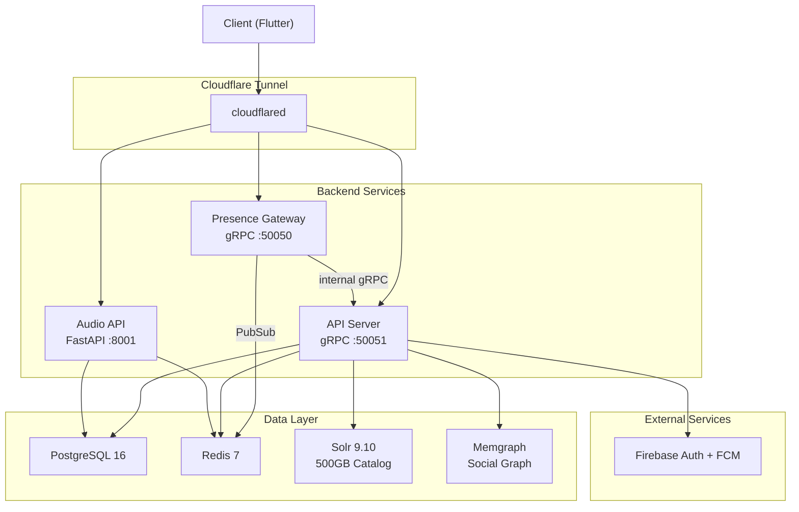

# Bluppi Backend

Distributed music streaming backend with synchronized multi-device playback, real-time presence, social features, and a 500GB music catalog. Built with Go, gRPC, and a polyglot data layer.

## Table of Contents

- [Architecture](#architecture)
- [Tech Stack](#tech-stack)
- [Project Structure](#project-structure)
- [Features](#features)
- [Prerequisites](#prerequisites)
- [Installation](#installation)
- [Running](#running)
- [Testing](#testing)
- [Health Check](#health-check)
- [Related Blog Posts](#related-blog-posts)
- [Contributing](#contributing)
- [License](#license)

## Architecture



**Request Flow**

1. Client connects through Cloudflare Tunnel via gRPC (TLS)
2. API Server handles all domain operations (users, music, rooms, playback, notifications)
3. Presence Gateway maintains persistent gRPC streams for online/offline status
4. Gateway publishes presence events to Redis PubSub, fans out to subscribed connections
5. Event bus (Redis Streams) drives async workflows: notifications, activity feeds, push delivery

## Tech Stack

| Component | Technology |
|---|---|
| Language | Go 1.25, Python 3 (audio service) |
| Transport | gRPC with Protobuf, TLS |
| Auth | Firebase Admin SDK (JWT verification) |
| Database | PostgreSQL 16 |
| Cache / PubSub / Streams | Redis 7 |
| Search | Apache Solr 9.10 (eDisMax, cursor pagination) |
| Graph | Memgraph (social graph, recommendations) |
| Push Notifications | Firebase Cloud Messaging |
| Containerization | Docker, Docker Compose |
| Tunnel | Cloudflare Tunnel (cloudflared) |
| Logging | Zerolog (structured, JSON) |

## Project Structure

```
bluppi-backend/
    cmd/
        api/                        # API server entrypoint
        gateway/                    # Presence gateway entrypoint
        loadtest/                   # Load testing tools
    internals/
        users/                      # User profiles, follows, social graph
        music/                      # Tracks, search, likes, history, discovery
        party/                      # Room creation, join/leave, live chat
        playback/                   # Synchronized playback, room state machine
        presence/                   # Heartbeat recording, session expiry
        gateway/                    # Connection manager, event fanout, streaming
        activity/                   # Friends activity feed
        notifications/              # Notification pipeline, FCM push delivery
        infrastructure/
            database/               # Postgres, Redis, Solr, Memgraph clients
            middlewares/            # Auth, logging, panic recovery interceptors
            routes/                 # gRPC service registration, handler wiring
            eventBus/               # Redis Streams publish/subscribe
            firebase/               # Firebase Auth + FCM initialization
        proto/                      # Protobuf service definitions
        gen/                        # Generated gRPC code (gitignored)
        utils/                      # Cursor encoding, pagination helpers
        tests/                      # Integration tests
    audio/                          # Python FastAPI service (yt-dlp)
    migrations/                     # ETL scripts for music catalog import
    certs/                          # TLS certificates (gitignored)
    cloudflared/                    # Tunnel configuration (secrets gitignored)
```

Each feature module follows a consistent layout:

```
internals/<feature>/
    handler.go                      # gRPC handler (transport layer)
    service.go                      # Business logic
    repository.go                   # Postgres data access
    model.go                        # Domain types
    mapper.go                       # Proto <> domain mapping
    memgraph_repo.go                # Graph database queries (where applicable)
    redis_repository.go             # Redis data access (where applicable)
    consumer.go                     # Event bus consumer (where applicable)
    reaper.go                       # Background cleanup goroutine (where applicable)
```

## Features

**Synchronized Playback**
Multi-device audio sync using PTP-style clock synchronization, quorum-based buffer readiness (80% threshold), and microsecond-precision scheduled start times. Playback state machine handles track changes, play/pause, and drift correction.

**Real-time Presence**
Dedicated gateway server with multi-device connection indexing, targeted subscriber fanout (O(1) event routing), and automatic session reaping. Load tested to 51k concurrent connections with zero errors.

**Music Catalog and Search**
500GB external catalog indexed in Solr. eDisMax queries with field boosting (`title^5 artists^2`), phrase boosting, and cursor-based deep pagination.

**Social Graph**
Follows, follower counts (trigger-maintained), friends activity feed, and graph-based music discovery (Memgraph). Weekly discover algorithm traverses listening patterns of followed users.

**Rooms and Live Chat**
Room creation with unique codes, public/private visibility, invite system, real-time event streaming (join/leave/chat via Redis PubSub), room lobby feed, and host heartbeat with automatic room reaping.

**Notifications**
Event-driven pipeline: domain events published to Redis Streams, consumed by notification workers, persisted to Postgres, and delivered via Firebase Cloud Messaging. Supports follow notifications, party invites, and listener activity alerts.

**Middlewares**
Chained gRPC interceptors for: Firebase JWT authentication (unary + stream), structured request logging with latency tracking, and panic recovery with stack trace capture. Mock auth is available but gated behind `GO_ENV=development`.

## Prerequisites

- Go 1.25+
- Docker and Docker Compose
- A Firebase project with Auth and Cloud Messaging enabled
- TLS certificates (self-signed works for development, see `san.cnf`)
- (Optional) Cloudflare Tunnel credentials for remote access

## Installation

```bash
git clone https://github.com/dis70rt/bluppi-backend.git
cd bluppi-backend
```

Copy and configure environment variables:

```bash
cp .env.example .env
# Edit .env with your database credentials, Redis config, etc.
```

Place your Firebase Admin SDK credentials JSON at the project root:

```bash
# Download from Firebase Console > Project Settings > Service Accounts
# The file is gitignored via the *adminsdk* pattern
cp your-firebase-adminsdk.json bluppi-app-firebase-adminsdk-fbsvc-XXXXXXXX.json
```

Generate TLS certificates for development:

```bash
openssl req -x509 -nodes -days 365 -newkey rsa:2048 \
  -keyout certs/server.key -out certs/server.crt \
  -config san.cnf
```

**Music Catalog**: The tracks database is a ~500GB external dataset. The ETL pipeline in `migrations/` handles importing catalog data into Postgres and Solr. Search will return empty results until you load your own catalog. See `migrations/main.py` for the import script.

## Running

**With Docker Compose (all services):**

```bash
make build
make up
```

This starts: PostgreSQL, Redis, Solr, Memgraph, API Server, Presence Gateway, Audio API, and Cloudflare Tunnel.

Other useful commands:

```bash
make logs        # Tail logs from all containers
make restart     # Stop and restart all services
make grid        # Open a tmux grid with per-service log panes
make down        # Stop all services
make clean       # Stop and remove volumes
```

**Running API server locally (without Docker):**

```bash
go run cmd/api/main.go
```

**Running Presence Gateway locally:**

```bash
go run cmd/gateway/main.go
```

## Testing

```bash
go test ./internals/... ./cmd/...
```

Integration tests are in `internals/tests/` and require a running Postgres instance configured via `TEST_DB_*` environment variables.

The API Docker image runs the full test suite as a build stage before producing the binary. See `Dockerfile.api`.

## Health Check

The API server implements the standard gRPC health checking protocol (`grpc.health.v1.Health`).

```bash
grpcurl -plaintext localhost:50051 grpc.health.v1.Health/Check
```

Response when serving:

```json
{
  "status": "SERVING"
}
```

## Related Blog Posts

In-depth writeups on some of the more involved subsystems in this project:

| Topic | Description |
|---|---|
| Clock Sync for Distributed Audio | PTP-style probing, jitter suppression, Kalman filter state tracking, and sub-millisecond playback alignment across devices. |
| Presence System at Scale | Multi-device connection indexing, targeted fanout, reaper pattern, and load testing to 50k+ concurrent users. |

*Links will be added here as posts are published.*

## Contributing

See [CONTRIBUTING.md](CONTRIBUTING.md).

## License

MIT. See [LICENSE](LICENSE).
